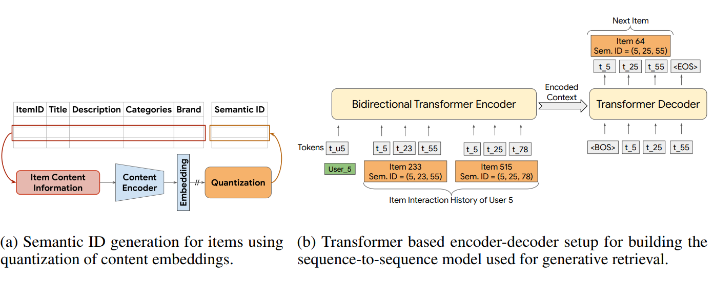
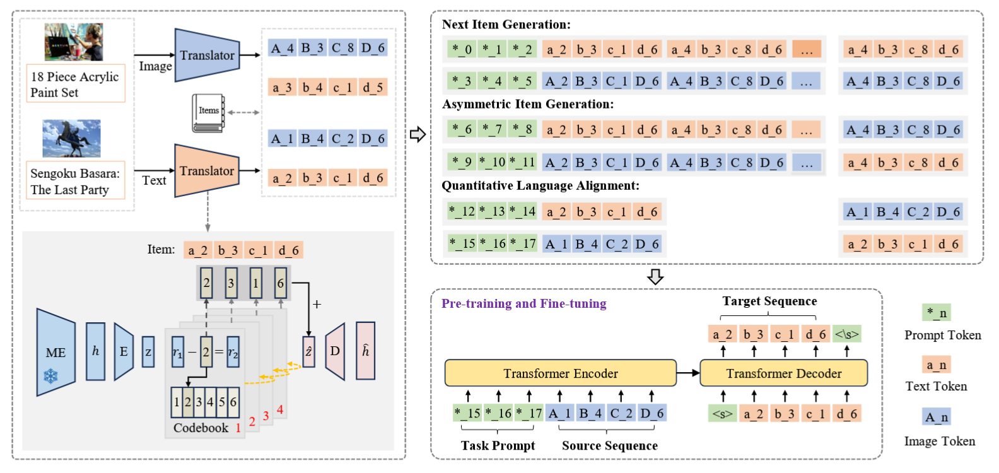
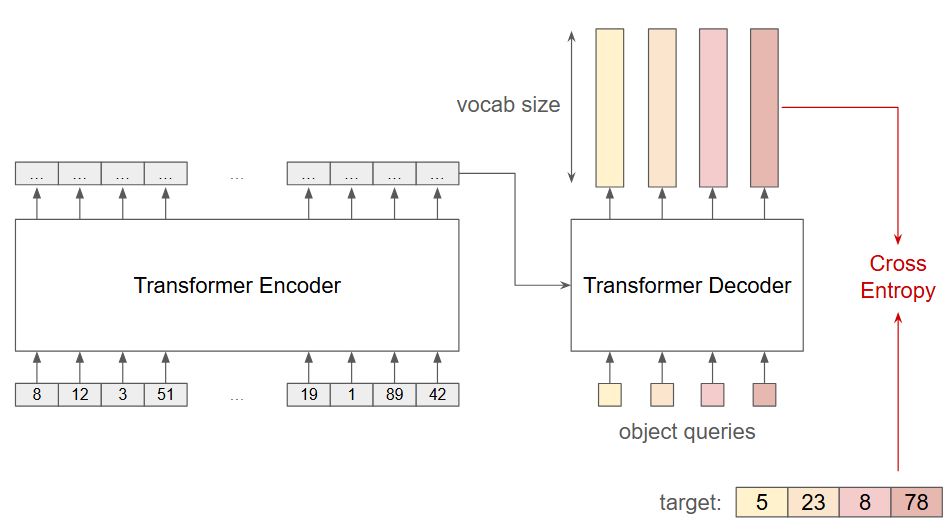
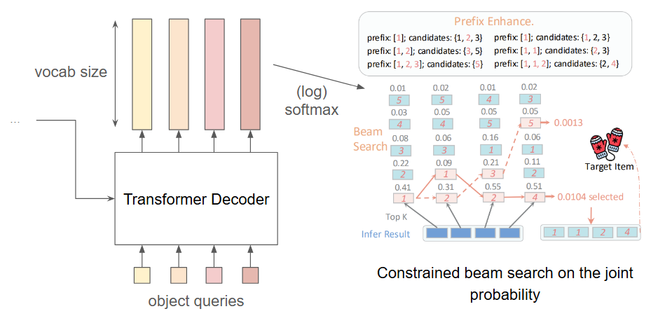

# How to Read This README

This README begins with the necessary **context** to understand the goal of the model and its implementation.
We first explain the difference between **generative recommendation** and **discriminative recommendation**, and introduce three related works that inspired our approach:

* **TIGER** ([paper](https://arxiv.org/pdf/2305.05065))
* **MQL4GRec** ([paper](https://openreview.net/pdf?id=v7YrIjpkTF))
* **SETRec** ([paper](https://arxiv.org/pdf/2502.10833))

We then describe the idea behind our model, **Parallel TIGER**, followed by:

1. An overview of the repository structure
2. Usage instructions

---

## Table of Contents
1. [Context](#Context)
2. [Idea: Parallel TIGER](#Parallel_TIGER)
3. [Repository Structure](#Repository)
3. [Getting Started](#GettingStarted)

---

<a name="Context"></a>

# Context 

## 1. Preliminary

We work in the **user–item sequential recommendation** setting:
Given a user’s past interactions, the goal is to **predict the next item** they will engage with.

**Evaluation protocol:**
For each user, generate *K* candidate items and compute metrics such as:

* Recall\@K
* Hit Rate\@K
* NDCG\@K (Normalized Discounted Cumulative Gain)

This stage is about **retrieval** (finding likely candidates), not ranking.

---

## 2. Discriminative Recommendation

In discriminative retrieval, we score candidate items based on the similarity between **user** and **item** representations.

A common example is the **dual-tower model**:

* One encoder maps each item to a dense vector (*item embedding*)
* Another encoder maps a user’s interaction history to a *user embedding*
* Candidate retrieval is done by comparing the user embedding against all item embeddings (dot product or cosine similarity)
* Approximate nearest neighbor (ANN) search is used to efficiently find the top-*K* items

---

## 3. Generative (Sequential) Recommendation

**Generative recommendation** is a newer paradigm inspired by generative retrieval in information retrieval.
The key idea: instead of scoring items, **generate** the ID of the next item in an *autoregressive* manner.

This approach was adapted for recommendation in
*"Recommender Systems with Generative Retrieval"* (Google, NeurIPS 2023), introducing **TIGER**.

### TIGER: Two-Step Approach

1. **Semantic ID Generation**

   * Each item is represented by a sequence of discrete tokens (a *Semantic ID*) derived from its text content (title, description, brand, etc.) embedding.
      * A Residual-Quantized VAE (**RQ-VAE**) encodes the item text embedding into a fixed-length token sequence, e.g. `<a_1><b_3><c_8><d_87>`.
   * Example: with 4 tokens per item and a codebook size of 256 (i.e. each token can take 256 different values), there are `256^4 ≈ 4.3 billion` possible IDs. Therefore, this configuration can be used for dataset up to 4.3 billion items.

2. **Generative Retrieval with Semantic IDs**

   * An encoder–decoder transformer predicts the token sequence of the next item, given the sequence of previous items (in token form).
   * The vocabulary is not a natural-language vocabulary but instead consists of the discrete tokens from the Semantic IDs (plus special tokens).
   * The model is trained with **cross-entropy** over the next-token prediction task.
   * At inference, beam search generates the top-*K* candidate token sequences.

<figure style="text-align:center">
  
  <figcaption><em>TIGER model overview (from the original paper).</em></figcaption>
</figure>

**Advantages of TIGER:**

* **Low memory footprint**: In discriminative methods, inference requires storing and querying a `(num_items × emb_dim)` dense embedding table in memory. For large catalogs, this can mean gigabytes (or more!) of GPU memory just for item representations (*). In TIGER, items are stored as `(num_items × num_tokens_per_item)` discrete IDs, which are small integers. This considerably reduces the memory needed for retrieval.
  * (*) Note: In large-scale production systems, discriminative recommenders often mitigate this memory cost by sharding the item embedding table across multiple GPUs or servers, so that each inference request only accesses the relevant shard. While effective, this adds engineering complexity and can introduce communication overhead, which the generative approach naturally avoids.
* **Inductive capabilities / Cold-start readiness**: New items can be added by computing their Semantic ID via the trained RQ-VAE (as long as we have their textual content), without retraining the transformer.
* **Diversity control**: Sampling temperature can be applied at various token levels.


**Disadvantage:**

* **High inference cost**: Autoregressive beam search is slow, making TIGER less suitable for low-latency production settings.

---

## 4. MQL4GRec
MQL4GRec builds upon TIGER by incorporating **image information** and addressing several TIGER limitations.

**Key contributions:**

* **Image pathway**:

  * Train another RQ-VAE on item image embeddings → each item has two Semantic IDs (text-based & image-based).
  * A single transformer processes both modalities jointly.
  * Add alignment tasks to bridge text and image representations.
  * Ensemble candidates from both modalities at inference.
* **Pretraining & finetuning**: Train on large datasets, then finetune on smaller ones.
* **Collision handling**: Resolve cases where multiple items map to the same Semantic ID.
* **Constrained generation**: Use a trie-based decoding constraint to only generate valid IDs (i.e IDs associated to items).

<figure style="text-align:center">
  
  <figcaption><em>MQL4GRec model overview (from the original paper).</em></figcaption>
</figure>


**Drawback:**
Inference is still slow. In our experiments, MQL4GRec was up to **156× slower than SASRec** (a transformer-based discriminative baseline).

---

## 5. SETRec

SETRec is a **discriminative sequential** recommender.

**Core idea:**

* Each item is represented by *m* embeddings.
* The transformer simulatenously (in one forward pass) produces *m* **user embeddings** from the interaction history **simultaneously, in a single forward pass.**
  * This is implemented via a **query-based decoder** (similar to [DETR](https://arxiv.org/abs/2005.12872)), where decoder inputs are *n\_query = m* learnable vectors.
* Matching is done between the *m* user embeddings and the *m* embeddings of each item.


**Limitation:**
Dynamic memory usage is *m* times higher than traditional discriminative recommeders (single-embedding models), which may impact scalability.

---
<a name="Parallel_TIGER"></a>

# Idea: Parallel TIGER

**Goal:** Combine the **TIGER/MQL4GRec** generative paradigm with **SETRec’s** idea of producing multiple outputs in parallel.

## 1. Item Representation

Same as TIGER/MQL4GRec: use an RQ-VAE to map item text (or image) embeddings to fixed-length Semantic IDs.

## 2. Parallel Generative Retrieval

* The encoder remains unchanged.
* The decoder is replaced with a **query-based decoder**:

  * Instead of autoregressive token-by-token input, we use *n\_query* learnable query vectors.
  * This produces *n\_query* logit vectors (one per token position) **in a single forward pass**.
  * Transformer vocabulary size = `n_modality x (n_query × codebook_size) + num_tokenizer_special_tokens`.

### Training

* Cross-entropy loss between predicted logits and target tokens for each position.
* See figure below for illustration.

<figure style="text-align:center">
  
  <figcaption><em>Parallel TIGER training overview.</em></figcaption>
</figure>


### Inference

* The model outputs the logits for all token positions in one step.
* Exact search over all combinations is infeasible (`codebook_size^n_query`), so we use an **approximate beam search**:

  * Fix an order (e.g., left-to-right)
  * Iteratively extend beams, keeping the top-*K* candidates
  * Enforce validity at each step (with masks and/or Trie object)

<figure style="text-align:center">
  
  <figcaption><em>Parallel TIGER training overview (right part of the figure from RecGPT paper).</em></figcaption>
</figure>


**Note:**
Switching from token-by-token autoregressive decoding (as in TIGER) to parallel generation already reduces inference time, since we only need a single decoder forward pass instead of one per token.
However, standard trie-based constrained beam search still creates a bottleneck due to nested loops over batch elements and beams.
To address this, we implemented a fully vectorized beam search that applies constraints using masks, eliminating those loops and further accelerating decoding.

(While this vectorized approach is faster, it consumes more memory than the traditional trie-based method, so its scalability still needs to be evaluated on larger datasets.)

## 3. Results
Preliminary experiments show up to **50× faster generation** compared to MQL4GRec, with **similar or slightly lower accuracy**.
Detailed benchmarks (Recall\@K, NDCG\@K) will be added soon.


---

<a name="Repository"></a>

# 📂 Repository Structure

## Root

```
.
├── conf/             # YAML configuration files (Hydra)
├── data/             # Placeholder for datasets
├── docs/             # Documentation and figures
├── log/              # Training / evaluation logs and checkpoints
├── src/              # Main source code
├── .gitignore        # Git ignore rules
├── requirements.txt  # Python dependencies
└── README.md
```

---

## 📂 `src/` — Source Code

```
src/
├── data_process/      # Scripts to compute embeddings from textual/image content (from MQL4GRec)
├── index/             # Scripts to compute Semantic IDs from embeddings (from MQL4GRec, + custom quantizers)
├── parallel_tiger/    # Core sequence modeling module (parallel transformer encoder-decoder) (partly from MQL4GRec/SETRec, mostly custom)
```

---

## 📂 `src/parallel_tiger/` — Parallel TIGER Model

```
parallel_tiger/
├── __init__.py
├── finetune_parallel_tiger.py   # Training script
├── test_ddp_parallel_tiger.py   # Inference script
│
├── data/            # Dataset loaders and data collators
├── evaluation/      # Evaluation metrics
├── generation/      # Candidate generation (trie, vectorized parallel beam search)
│
├── model/
│   ├── __init__.py
│   ├── config.py            # Model configs (custom)
│   ├── custom_attention.py  # Modified T5 attention with custom bias (custom)
│   ├── model_t5.py          # Wrapper around Q_t5: forward pass, loss, generation
│   └── Q_t5.py              # Transformer model (adapted from SETRec, modified for sparse reps)
│
├── tokenizer/       # Custom tokenizer
└── utils/           # Miscellaneous utils
```

---

<a name="GettingStarted"></a>

# 🚀 Getting Started

## 1. Prerequisites

* **Python**: 3.11
* **Hardware**: 2× Tesla V100 GPUs (recommended for training Parallel TIGER)
* **ClearML** (optional, for experiment tracking):

  * Create a ClearML account
  * Run `clearml-init` once and configure your credentials

## 2. Installation

Install the Python dependencies:

```bash
pip install -r requirements.txt
```

*Note*: an installation script (e.g., `pyproject.toml`) will be added in the future to simplify setup. For now, `requirements.txt` is sufficient.

---

## 3. Data Preparation

The **data\_process** pipeline (from MQL4GRec) handles downloading and preprocessing item content.

```bash
cd src/data_process
bash 1_load_figure.sh     # Download item images
bash 2_process.sh         # Filter items
bash 3_get_text_emb.sh    # Extract text embeddings
bash 4_get_image_emb.sh   # Extract image embeddings
```

---

## 4. Train Quantizers

Train quantization models and generate Semantic IDs (from MQL4GRec).

```bash
cd src/index
bash scripts/run.sh        # Train quantizer model
bash scripts/gen_code_dis.sh # Generate quantized codes
```

---

## 5. Train Parallel TIGER

⚡ Run from the **root directory**. Logging is handled both locally (`log/`) and via ClearML (if enabled).
You must provide an experiment name via `exp_name=...`.

**Basic command:**

```bash
PYTHONPATH=src torchrun --nproc_per_node=2 --master_port=2309 \
    src/parallel_tiger/finetune_parallel_tiger.py exp_name="EXP_NAME" +args
```

**Example:**

```bash
PYTHONPATH=src torchrun --nproc_per_node=2 --master_port=2309 \
    src/parallel_tiger/finetune_parallel_tiger.py \
    exp_name="codebook_decoder_self_attention_bias_lr5e_3" \
    has_relative_decoder_codebook_bias_sa=True \
    train.learning_rate=5e-3
```

---

### 6. Inference with Parallel TIGER

Run inference with the same experiment setup:

```bash
PYTHONPATH=src torchrun --nproc_per_node=2 --master_port=2309 \
    src/parallel_tiger/test_ddp_parallel_tiger.py exp_name="EXP_NAME" +args
```

**Example:**

```bash
PYTHONPATH=src torchrun --nproc_per_node=2 --master_port=2309 \
    src/parallel_tiger/test_ddp_parallel_tiger.py \
    exp_name="codebook_decoder_self_attention_bias_lr5e_3" \
    has_relative_decoder_codebook_bias_sa=True \
    train.learning_rate=5e-3
```
